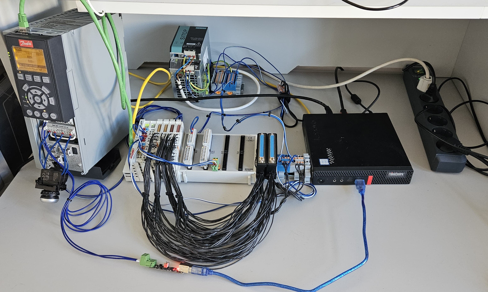
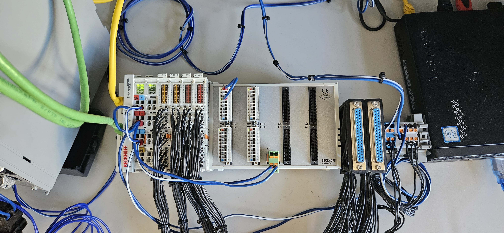

# Maho400E-LinuxCNC-Retrofit (WIP!)
LinuxCNC Maho400E Retrofit configuration (EtherCAT IO)

## Goal & Milestones
We are aiming to build a LinuxCNC operated retrofitted Maho MH400E with most of the original hardware.

accomplished Milestones / ToDo:
- ✅ all Beckhoff IO working correctly
- 🔲 functioning VFD entry in ethercat-conf.xml
- 🔲 add VL-capability to CiA402 component
- 🔲 adaptor for Indramat driver and glass-scale inputs working
- 🔲 mapping MAHO IO
- 🔲 implementing gearbox component of RotarySMPs MAHO retrofit

## Testbench

## EtherCAT Slaves
0. Beckhoff [EK1101](https://www.beckhoff.com/de-de/produkte/i-o/ethercat-klemmen/ek1xxx-bk1xx0-ethercat-koppler/ek1101.html) EtherCAT Coupler with ID-switch
1. Beckhoff [EL5002](https://www.beckhoff.com/de-de/produkte/i-o/ethercat-klemmen/el5xxx-winkel-wegmessung/el5002.html) 2 Chanel SSI Encoder Interface - for spindle (rigid tapping) 
2. Beckhoff [EL1819](https://www.beckhoff.com/de-de/produkte/i-o/ethercat-klemmen/el1xxx-digital-eingang/el1819.html) 16 digital inputs, 10 µs
3. Beckhoff [EL1819](https://www.beckhoff.com/de-de/produkte/i-o/ethercat-klemmen/el1xxx-digital-eingang/el1819.html) 16 digital inputs, 10 µs
4. Beckhoff [EL2809](https://www.beckhoff.com/de-de/produkte/i-o/ethercat-klemmen/el2xxx-digital-ausgang/el2809.html) 16 digital outputs, 24 V, 0.5 A
5. Beckhoff [EL2809](https://www.beckhoff.com/de-de/produkte/i-o/ethercat-klemmen/el2xxx-digital-ausgang/el2809.html) 16 digital outputs, 24 V, 0.5 A
6. Beckhoff [EM7004](https://www.beckhoff.com/de-de/produkte/i-o/ethercat-klemmen/el-elm7xxx-kompakte-antriebstechnik/em7004.html) 4-axis analog input/output module with encoder inputs
7. [Danfoss FC302](https://www.danfoss.com/de-de/products/dds/low-voltage-drives/vlt-drives/vlt-automationdrive-fc-301-fc-302/) with [MCA124 EtherCAT](https://store.danfoss.com/de/de/Drives/Niederspannungsantriebe/Zubeh%C3%B6r-f%C3%BCr-Niederspannungsantriebe/Zubeh%C3%B6r-FC-301-302/VLT%C2%AE-EtherCAT-MCA-124%2C-besch-/p/130B5646) module

## Host
A Lenovo M720q with a PCIe riser and an additional Broadcom BCM5720 dual-port NIC (LAN), Intel i5-8400T, 8 GB of RAM and a Samsung M.2 SSD are the brains of the CNC machine and testbench. The EtherCAT Master runs of of the integrated Intel NIC. THe Lenovo-PC also powered by the 24 V Siemens PSU.

I'm using the machine headless interacting with it via VNC ([server](https://wiki.ubuntuusers.de/VNC/#x11vnc) and [client](https://uvnc.com/downloads/ultravnc.html)). Without a monitor attached to the system i had severe problems with the responsiveness and latency of the system. After installing such a [dummy monitor adaptor](https://www.amazon.de/gp/product/B07YLP1GG4/) the problem was gone. 

## Danfoss VFD
TLDR:
At the moment, the Danfoss VFD does not run with the LinuxCNC EtherCAT master. 

I got the VFD somewhat working in the ethercat-config-xml file. While system startup it sets a error-flag and remains in PREOP. When trying out config snippets of the Omron MX2 VFD i finally managed to get it into OP state without the error-flag set. Unfortunately the VFD reports to not support Distributed Clocks at all and while trying to change any settings in the EtherCAT-Configurator application, i am just getting bluescreens. Now when starting a machine, the VFD at least gets into OP state sometimes and is also sporadically reporting the correct set maximum revolutions per minute '''2840'''. I'm reaching out to the manufacturer for help. Four different machine startups reveal three differently reported parameters. Pictures of that problem can be found in the [corresponding subfolder](pictures/VFD-lcec-config/). Further information can be found in [this file](info/general_info.txt)

There is also a old test project attached in the [DanfossVFD_RS485](DanfossVFD_RS485-Config/) folder, that uses the [VLT5000 component](http://wiki.linuxcnc.org/cgi-bin/wiki.pl?ContributedComponents#Danfoss_VLT5000_VFD_driver_vlt5000_vfd) and the RS485 Interface of the VFD.

## Connecting the analog motor drivers and glass scales
I'm currently designing an adaptor board to reuse most of the original hardware. The seperate project for the encoder input and motor driver control can be found [here](https://github.com/PedPEx/EM7004-Maho-Philips-432). One of the adaptor boards is used for two axis. The installation is very easy, just remove the supplied terminals, plug in the 24 V supply and the adaptor-pcb into one of the dual analog-axis rows.

## DB37 connectors
Maho uses two DB37 / DSUB37 connectors for their 32 inputs and 32 outputs. I 3D printed a din-rail adaptor to mount the female sockets right next to the beckhoff modules. The design files for the [DB37 DIN-Rail Adaptor](https://than.gs/m/1134640) are on my thangs account. 

## Danfoss Drive config file
The [config file](configs/MAHO_3kW_EtherCAT_MCT10.ssp) for the Danfoss drive is also attached. To use it or have a look at it, you need the free software MCT10 by Danfoss, that can be downloaded [from their website](https://www.danfoss.com/de-de/service-and-support/downloads/dds/vlt-motion-control-tool-mct-10/).