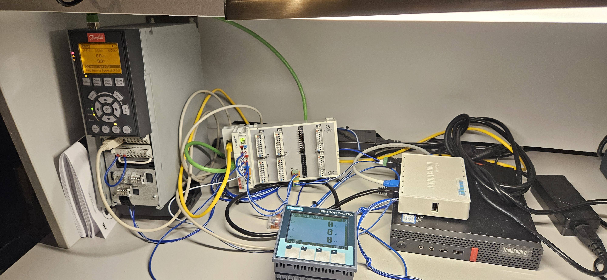

<<<<<<< HEAD
# Maho400E-LinuxCNC (WIP!)
LinuxCNC Maho400E configuration (EtherCAT IO)

## Goal
We are aiming to build a LinuxCNC operated retrofitted Maho MH400E with most of the original hardware.
First milestone will be a working testbench with all EtherCAT Slaves working.
The plan also involves to interact with a Siemens PAC3200, getting the used electrical energy via ModbusTCP and automatically generating some kind of report for automatic invoice generation or similar.

## Testbench

## EtherCAT Slaves
0. Beckhoff [EK1100](https://www.beckhoff.com/de-de/produkte/i-o/ethercat-klemmen/ek1xxx-bk1xx0-ethercat-koppler/ek1100.html) EtherCAT Coupler
1. Beckhoff [EM7004](https://www.beckhoff.com/de-de/produkte/i-o/ethercat-klemmen/el-elm7xxx-kompakte-antriebstechnik/em7004.html) 4-axis analog input/output module
2. [Danfoss FC302](https://www.danfoss.com/de-de/products/dds/low-voltage-drives/vlt-drives/vlt-automationdrive-fc-301-fc-302/) with [MCA124 EtherCAT](https://store.danfoss.com/de/de/Drives/Niederspannungsantriebe/Zubeh%C3%B6r-f%C3%BCr-Niederspannungsantriebe/Zubeh%C3%B6r-FC-301-302/VLT%C2%AE-EtherCAT-MCA-124%2C-besch-/p/130B5646) module

## Host
A Lenovo M720q with a PCIe riser and an additional Broadcom BCM5720 dual-port NIC, Intel i5-8400T, 8 GB of RAM and a Samsung M.2 SSD are the brains of the CNC machine and testbench. 

I'm using the machine headless interacting with it via VNC ([server](https://wiki.ubuntuusers.de/VNC/#x11vnc) and [client](https://uvnc.com/downloads/ultravnc.html)). Without a monitor attached to the system i had some severe problems with the responsiveness and latency of the system. After installing such a [dummy monitor adaptor](https://www.amazon.de/gp/product/B07YLP1GG4/) the problem was gone. 

## Connecting the analog motor drivers and glass scales
I'm currently designing an adaptor board to reuse most of the original hardware. The seperate project for the encoder input and motor driver control can be found [here](https://github.com/PedPEx/EM7004-Maho-Philips-432). One of the adaptor boards is used for two axis. The installation is very easy, just remove the supplied terminals, plug in the 24 V supply and the adaptor-pcb into one of the dual analog-axis rows.

## Danfoss Drive config file
=======
# Maho400E-LinuxCNC (WIP!)
LinuxCNC Maho400E configuration (EtherCAT IO)

## Goal
We are aiming to build a LinuxCNC operated retrofitted Maho MH400E with most of the original hardware.
First milestone will be a working testbench with all EtherCAT Slaves working.
The plan also involves to interact with a Siemens PAC3200, getting the used electrical energy via ModbusTCP and automatically generating some kind of report for automatic invoice generation or similar.

## Testbench

## EtherCAT Slaves
0. Beckhoff [EK1100](https://www.beckhoff.com/de-de/produkte/i-o/ethercat-klemmen/ek1xxx-bk1xx0-ethercat-koppler/ek1100.html) EtherCAT Coupler
1. Beckhoff [EM7004](https://www.beckhoff.com/de-de/produkte/i-o/ethercat-klemmen/el-elm7xxx-kompakte-antriebstechnik/em7004.html) 4-axis analog input/output module
2. [Danfoss FC302](https://www.danfoss.com/de-de/products/dds/low-voltage-drives/vlt-drives/vlt-automationdrive-fc-301-fc-302/) with [MCA124 EtherCAT](https://store.danfoss.com/de/de/Drives/Niederspannungsantriebe/Zubeh%C3%B6r-f%C3%BCr-Niederspannungsantriebe/Zubeh%C3%B6r-FC-301-302/VLT%C2%AE-EtherCAT-MCA-124%2C-besch-/p/130B5646) module

## Host
A Lenovo M720q with a PCIe riser and an addition Broadcom BCM5720 dual-port NIC, Intel i5-8400T, 8 GB of RAM and a Samsung M.2 SSD are the brains of the CNC machine and testbench. 

I'm using the machine headless interacting with it via VNC ([server](https://wiki.ubuntuusers.de/VNC/#x11vnc) and [client](https://uvnc.com/downloads/ultravnc.html)). Without a monitor attached to the system i had some severe problems with the responsiveness and latency of the system. After installing such a [dummy monitor adaptor](https://www.amazon.de/gp/product/B07YLP1GG4/) the problem was gone. 

## Goal
We are aiming to build a LinuxCNC operated retrofitted Maho MH400E with most of the original hardware.
First milestone will be a working testbench with all EtherCAT Slaves working.
The plan also involves to interact with a Siemens PAC3200, getting the used electrical energy via ModbusTCP and automatically generating some kind of report for automatic invoice generation or similar.

## Testbench

## EtherCAT Slaves
0. Beckhoff [EK1100](https://www.beckhoff.com/de-de/produkte/i-o/ethercat-klemmen/ek1xxx-bk1xx0-ethercat-koppler/ek1100.html) EtherCAT Coupler
1. Beckhoff [EM7004](https://www.beckhoff.com/de-de/produkte/i-o/ethercat-klemmen/el-elm7xxx-kompakte-antriebstechnik/em7004.html) 4-axis analog input/output module
2. [Danfoss FC302](https://www.danfoss.com/de-de/products/dds/low-voltage-drives/vlt-drives/vlt-automationdrive-fc-301-fc-302/) with [MCA124 EtherCAT](https://store.danfoss.com/de/de/Drives/Niederspannungsantriebe/Zubeh%C3%B6r-f%C3%BCr-Niederspannungsantriebe/Zubeh%C3%B6r-FC-301-302/VLT%C2%AE-EtherCAT-MCA-124%2C-besch-/p/130B5646) module

## Host
A Lenovo M720q with a PCIe riser and an additional Broadcom BCM5720 dual-port NIC, Intel i5-8400T, 8 GB of RAM and a Samsung M.2 SSD are the brains of the CNC machine and testbench. 

I'm using the machine headless interacting with it via VNC ([server](https://wiki.ubuntuusers.de/VNC/#x11vnc) and [client](https://uvnc.com/downloads/ultravnc.html)). Without a monitor attached to the system i had some severe problems with the responsiveness and latency of the system. After installing such a [dummy monitor adaptor](https://www.amazon.de/gp/product/B07YLP1GG4/) the problem was gone. 

## Connecting the analog motor drivers and glass scales
I'm currently designing an adaptor board to reuse most of the original hardware. The seperate project for the encoder input and motor driver control can be found [here](https://github.com/PedPEx/EM7004-Maho-Philips-432). One of the adaptor boards is used for two axis. The installation is very easy, just remove the supplied terminals, plug in the 24 V supply and the adaptor-pcb into one of the dual analog-axis rows.

## Danfoss Drive config file
>>>>>>> c1f59381ff0be3781d2ba4cc7a13103ed8d57808
The [config file](configs/MAHO_3kW_EtherCAT_MCT10.ssp) for the Danfoss drive is also attached. To use it or have a look at it, you need the free software MCT10 by Danfoss, that can be downloaded [from their website](https://www.danfoss.com/de-de/service-and-support/downloads/dds/vlt-motion-control-tool-mct-10/).