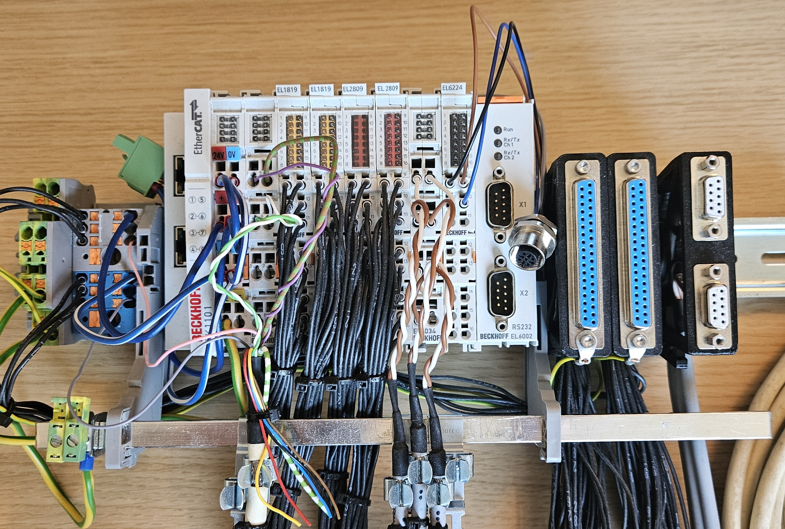
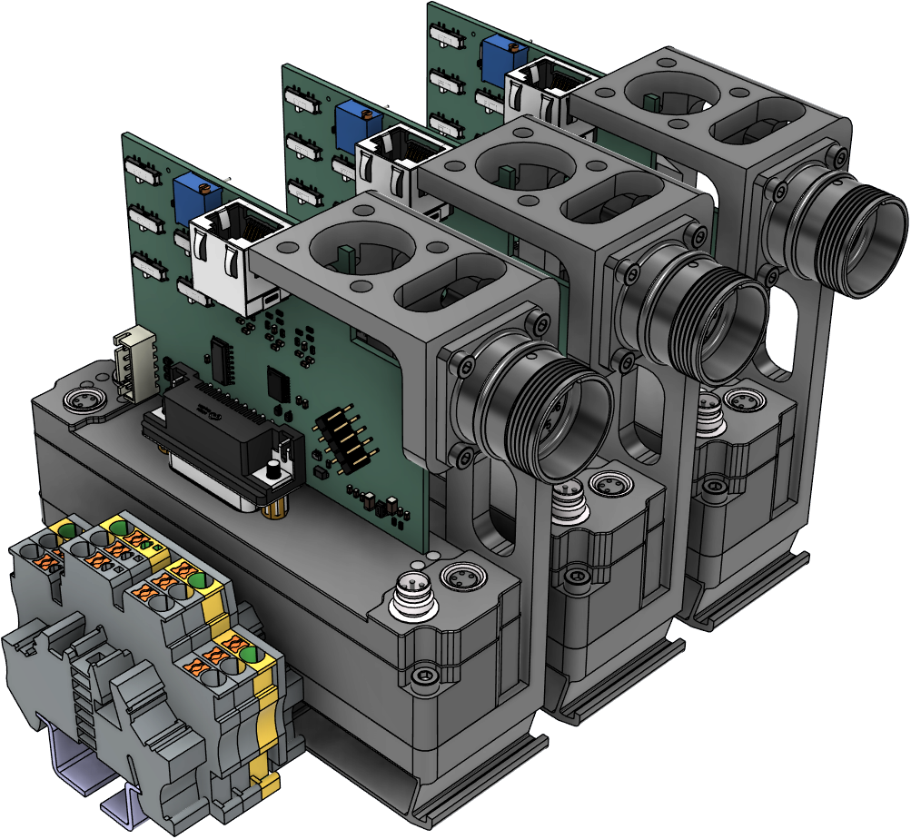
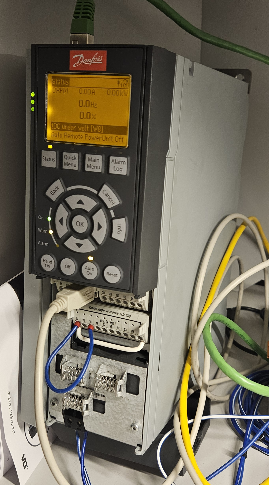

# Maho400E-LinuxCNC-Retrofit (WIP!)
LinuxCNC Maho400E Retrofit configuration (EtherCAT IO)

## Goals & Milestones
We are aiming to build a LinuxCNC operated retrofitted Maho MH400E with most of the original hardware.

accomplished Milestones / ToDo:
- ✅ all Beckhoff IO working correctly
- ✅ Danfoss FC302 (```MCA124```) working
- ✅ functioning VFD entry in ethercat-conf.xml
- 🔲 rigid tapping working with VFD
- 🔲 add VL-capability to CiA402 component
- ~~☑️ adaptor for Indramat driver and glass-scale inputs working (finished, needs testing)~~
- 🔲 mapping MAHO IO
- 🔲 implementing [gearbox component](https://github.com/jin-eld/mh400e-linuxcnc/blob/master/mh400e_gearbox.comp) of [RotarySMPs MAHO retrofit](https://github.com/jin-eld/mh400e-linuxcnc) with VFD

## Testbench
| Used Beckhoff IO Terminals | New [Encoder Input](https://github.com/PedPEx/SinCosEnc-Conv_EP5101) Setup | Danfoss FC302 with MCA124 |
|-----|-----|-----|
|  |  |  |

## EtherCAT Slaves
0. Beckhoff [EK1101](https://www.beckhoff.com/de-de/produkte/i-o/ethercat-klemmen/ek1xxx-bk1xx0-ethercat-koppler/ek1101.html) EtherCAT Coupler with ID-switch
1. Beckhoff [EL5002](https://www.beckhoff.com/de-de/produkte/i-o/ethercat-klemmen/el5xxx-winkel-wegmessung/el5002.html) 2 Channel SSI Encoder Interface - for spindle (rigid tapping) 
2. Beckhoff [EL1819](https://www.beckhoff.com/de-de/produkte/i-o/ethercat-klemmen/el1xxx-digital-eingang/el1819.html) 16 digital inputs, 10 µs
3. Beckhoff [EL1819](https://www.beckhoff.com/de-de/produkte/i-o/ethercat-klemmen/el1xxx-digital-eingang/el1819.html) 16 digital inputs, 10 µs
4. Beckhoff [EL2809](https://www.beckhoff.com/de-de/produkte/i-o/ethercat-klemmen/el2xxx-digital-ausgang/el2809.html) 16 digital outputs, 24 V, 0.5 A
5. Beckhoff [EL2809](https://www.beckhoff.com/de-de/produkte/i-o/ethercat-klemmen/el2xxx-digital-ausgang/el2809.html) 16 digital outputs, 24 V, 0.5 A
6. Beckhoff [EL4034](https://www.beckhoff.com/de-de/produkte/i-o/ethercat-klemmen/el-ed4xxx-analog-ausgang/el4034.html) 4 Channel +/-10V 12bit Analog Output
7. Beckhoff [EL6002](https://www.beckhoff.com/de-de/produkte/i-o/ethercat-klemmen/el-ed6xxx-kommunikation/el6002.html) 2 Channel RS232 Communication Terminal
8. Beckhoff [EP5101-0011](https://www.beckhoff.com/de-de/produkte/i-o/ethercat-box/epxxxx-industriegehaeuse/ep5xxx-winkel-wegmessung/ep5101-0011.html) Incremental TTL/RS422 Encoder Input (X-Axis - with [Custom Interpolator PCB](https://github.com/PedPEx/SinCosEnc-Conv_EP5101))
9. Beckhoff [EP5101-0011](https://www.beckhoff.com/de-de/produkte/i-o/ethercat-box/epxxxx-industriegehaeuse/ep5xxx-winkel-wegmessung/ep5101-0011.html) Incremental TTL/RS422 Encoder Input (Y-Axis - with [Custom Interpolator PCB](https://github.com/PedPEx/SinCosEnc-Conv_EP5101))
10. Beckhoff [EP5101-0011](https://www.beckhoff.com/de-de/produkte/i-o/ethercat-box/epxxxx-industriegehaeuse/ep5xxx-winkel-wegmessung/ep5101-0011.html) Incremental TTL/RS422 Encoder Input (Z-Axis - with [Custom Interpolator PCB](https://github.com/PedPEx/SinCosEnc-Conv_EP5101))
11. [Danfoss FC302](https://www.danfoss.com/de-de/products/dds/low-voltage-drives/vlt-drives/vlt-automationdrive-fc-301-fc-302/) with [MCA124 EtherCAT](https://store.danfoss.com/de/de/Drives/Niederspannungsantriebe/Zubeh%C3%B6r-f%C3%BCr-Niederspannungsantriebe/Zubeh%C3%B6r-FC-301-302/VLT%C2%AE-EtherCAT-MCA-124%2C-besch-/p/130B5646) module

## Documentation
My bachelor's thesis addressed the topic of this retrofit in detail. Feel free to use it as a reference. The components were not installed within the CNC mill, but that step is planned in the near future (coming soon™).

The [thesis](docs/bachelors_thesis.pdf) can be found in the ```docs``` subfolder.

## Reference Configuration
[RotarySMP](https://github.com/rotarysmp) already retrofitted the exact same MAHO MH400E CNC mill with Mesa hardware and made a [very good video](https://www.youtube.com/watch?v=LXwbRhgq1og) about it. In the still ongoing [discussion on the LinuxCNC Forum](https://forum.linuxcnc.org/12-milling/33035-retrofitting-a-1986-maho-mh400e) he also shared his configuration, which was also used within this project and can be found within the [RotarySMP_reference](RotarySMP_reference/) subfolder (only INI and HAL file).

## Host
A Lenovo P330 with a PCIe riser and an additional Intel I350-T4 quad-port NIC (LAN), Intel i7-8700, 16 GB of RAM and a Samsung M.2 SSD are the brains of the CNC machine and testbench. The EtherCAT Master runs on two of the Intel NIC ports. ~~The Lenovo-PC also powered by the 24 V Siemens PSU.~~ (NOT RECOMMENDED, ONE CPU PHASE DIED!)

I'm using the machine headless interacting with it via VNC ([server](https://wiki.ubuntuusers.de/VNC/#x11vnc) and [client](https://uvnc.com/downloads/ultravnc.html)). Without a monitor attached to the system i had severe problems with the responsiveness and latency of the system. After installing such a [dummy monitor adaptor](https://www.amazon.de/gp/product/B07YLP1GG4/) the problem was gone. 

## Danfoss VFD
After a lot of difficulties implementing the Danfoss VFD related to standard ```CiA402``` data objects not being able to access as PDOs and vibe coding a custom lcec driver for the [linuxcnc-ethercat](https://github.com/PedPEx/linuxcnc-ethercat) project, the VFD is now finally fully working.

There is also a old test project attached in the [DanfossVFD_RS485](z_old/DanfossVFD_RS485-Config/) folder, that uses the [VLT5000 component](http://wiki.linuxcnc.org/cgi-bin/wiki.pl?ContributedComponents#Danfoss_VLT5000_VFD_driver_vlt5000_vfd) and the RS485 Interface of the VFD.

## Connecting the analog motor drivers and glass scales
The first attempt with the help of a Beckhoff EM7004 and a [custom designed adapotr board](https://github.com/PedPEx/EM7004-Maho-Philips-432) wasn't possible, due to a to the limited 16 bit wide counter. 

In order to read the Glass Scales with up to 570 mm of travel, a at least 19 bit wide counter was required. To make mounting of the required [Interpolator PCB](https://github.com/PedPEx/SinCosEnc-Conv_EP5101) as easy as possible, the EtherCAT Box ```EP5101-0011``` was sourced, which offers a standard D-Sub 15 connector. To control the DC motors, a four channel +/-10V analog output terminal ```EL4034``` is used. A custom dual 9 pin D-Sub connector terminal allows a plug'n'play retrofit.

## DB37 connectors
Maho uses two DB37 / DSUB37 connectors for their 32 inputs and 32 outputs. I 3D printed a din-rail adaptor to mount the female sockets right next to the Beckhoff modules. The design files for the [DB37 DIN-Rail Adaptor](https://than.gs/m/1134640) are on my thangs account. 

## Danfoss Drive config file (MCT10)
The [config file](info/danfoss_mca124/MAHO_3kW_EtherCAT_MCT10.ssp) for the Danfoss drive is also attached. To use it or have a look at it, you need the free software MCT10 by Danfoss, that can be downloaded [from their website](https://www.danfoss.com/de-de/service-and-support/downloads/dds/vlt-motion-control-tool-mct-10/).

## Festo VFD (not used anymore)
TLDR:
Misread "AC-synchron" as "Asynchron" within the datasheet. The Festo driver was therefore abandoned.

The Festo VFD is supposed to support ```CSP``` as well as ```CSV```. Interestingly, even without the machine config running, the drive directly changes into ```OP mode```. Let's hope it works with LinuxCNC. The used Festo VFD is a [```CMMT-AS-C5-11A-P3-MP-S1```](https://www.festo.com/de/de/a/8143167/) i got really cheap on ebay (€ 35,50). Test config can be found [here](Festo-TestConfig/). New pictures of testbench v3 in the [pictures folder](pictures/).

## Festo Drive config file (Festo Automation Suite - not used anymore)
My [config file](info/festo_cmmt-as/Maho_MH400E.fsp) for the Festo VFD is also provided. To use it or have a look at it, you need the free software Festo Automation Suite by Festo, that can be downloaded [from their website](https://www.festo.com/de/de/search/?text=festo%2520automation%2520suite&tab=DOWNLOADS&supportPortalTab=software).