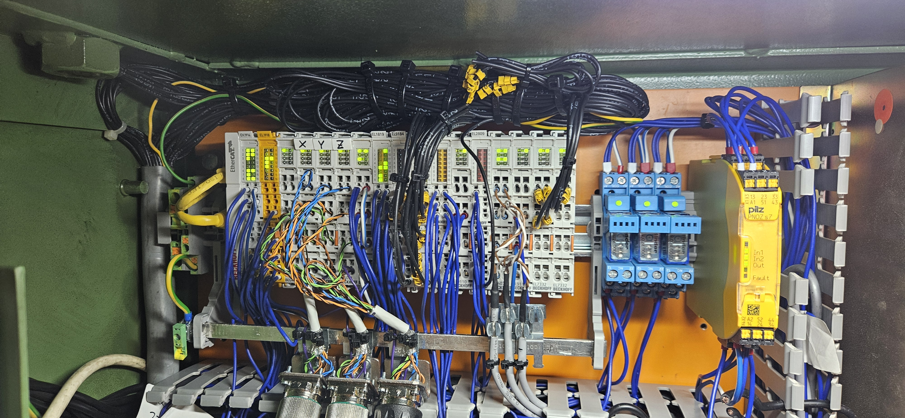
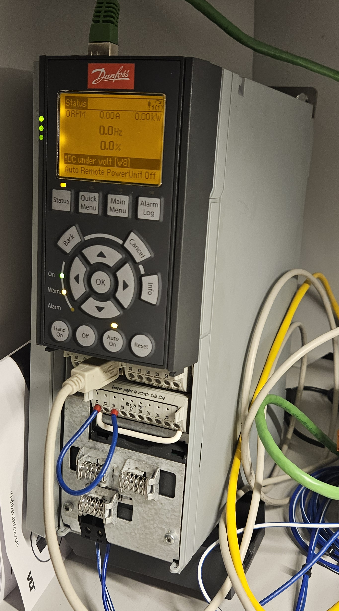
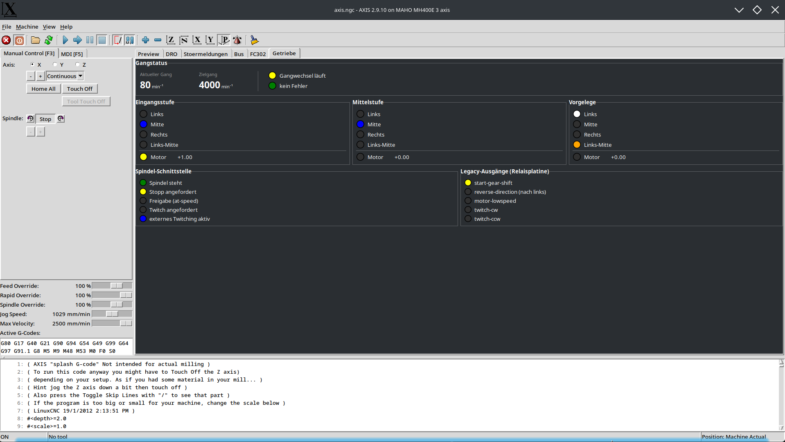
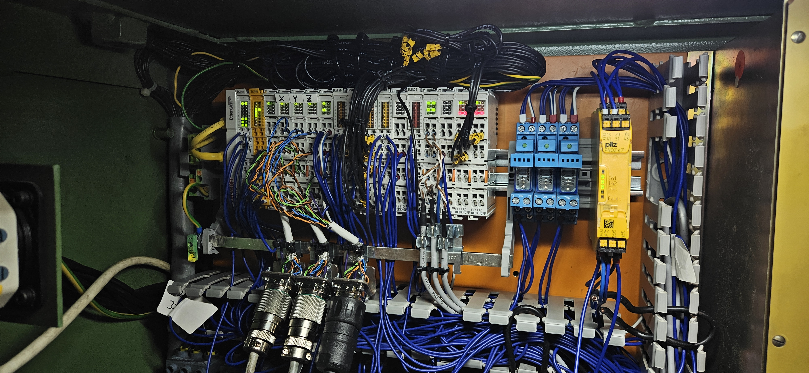
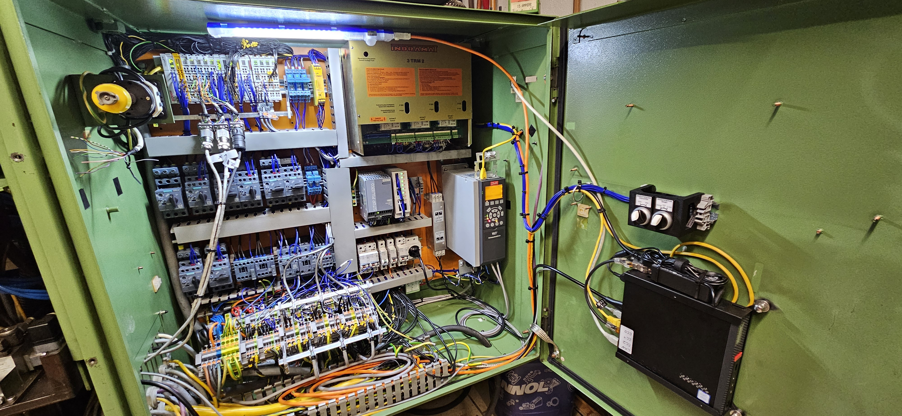
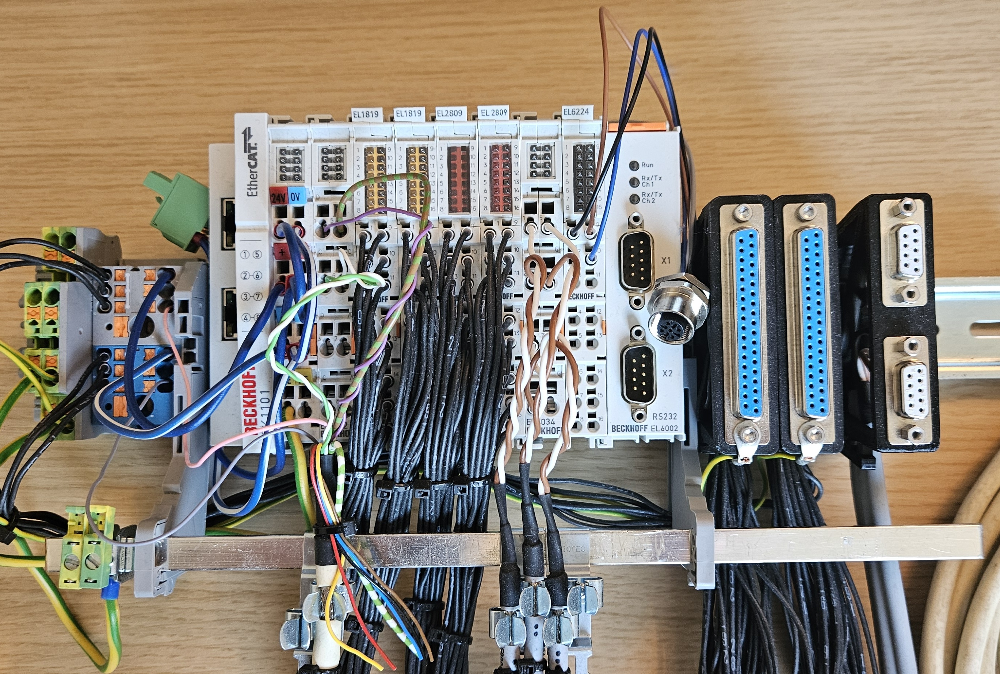
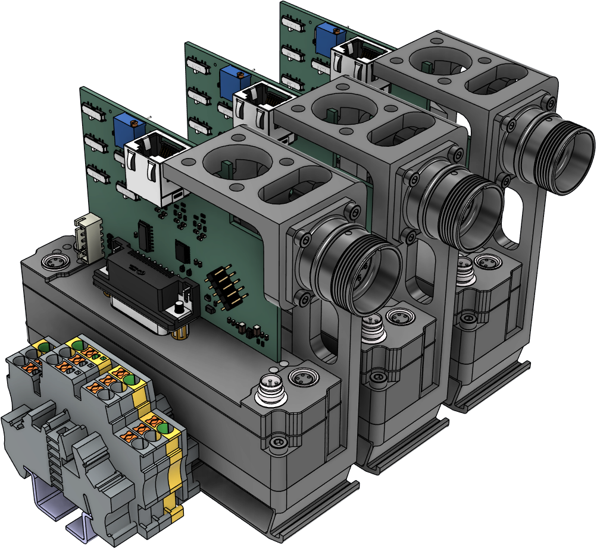

# Maho400E-LinuxCNC-Retrofit (WIP!)
LinuxCNC Maho400E Retrofit configuration (EtherCAT IO)

We are aiming to build a full LinuxCNC operated, EtherCAT retrofitted Maho MH400E 

> **Disclaimer:** All EtherCAT drivers, LinuxCNC components and big portions of the machine HAL files were written by the AI agent Claude

**Locations:**
- EtherCAT lcec drivers: [costum lcec library](https://github.com/PedPEx/linuxcnc-ethercat)<br>
added or modified support due to this retrofit for:
  - EL1918 (modified) - all eight inputs can be read for diagnosis
  - EK1914 (new) - fully tested
  - EL5021 (new) - fully tested
  - EL7332 (new) - fully tested
  - EL5002 (modified) - fault in modParam section fixed
  - EL9410 (modified) - added voltage ok bits, backwards compatible
  - Danfoss FC302 MCA124 (new) - fully tested
- LinuxCNC Components (3 x Spindle, 1 x Toolclamping, 1 x BusCheck, 1 x ErrorMessages, 1 x Beckhoff Encoder Homing): [component subfolder](MAHO_Test/components)
- Modification Instructions EL5021: [EL5021_multi-signal-mod](https://github.com/PedPEx/EL5021_multi-signal-mod)

## Goals & Milestones
accomplished Milestones / ToDo:
- ✅ All EtherCAT slaves working + having lcec driver support
    - ✅ working Danfoss FC302 (```MCA124```) lcec driver
    - ✅ working EL7332 lcec driver
    - ✅ working EL5021 lcec driver
    - ✅ working EL1918 lcec driver and working as SafetyPLC
- ✅ Distributed Clocks (DC) working with EL5002, EL5021 and EL4034 terminals ([details](MAHO_Test/Docs/EthercatDistributedClocksConfig.md))
- ✅ [modified EL5021](https://github.com/PedPEx/EL5021_multi-signal-mod) reading LS403 glass scales directly
- ✅ costum LinuxCNC homing component for Beckhoff encoders
- ✅ EL7332 terminals controlling gearmotors
- ✅ Spindle components working
    - ✅ costum Component to drive Gearbox <br> dropin replacement of [RotarySMPs gearbox component](https://github.com/jin-eld/mh400e-linuxcnc/blob/master/mh400e_gearbox.comp): [mh400e_gearbox_el7332.comp](MAHO_Test/components/gearbox) <br>
    (works also standalone if no VFD is used (untested!), meant for retrofits keeping the original power-wiring and components)
    - ✅ costum Component to talk to Danfoss FC302 VFD: [fc302_spindle.comp](MAHO_Test/components/spindle)
    - ✅ costum Component to coordinate both Gearbox and VFD component: [mh400e_spindle_master.comp](MAHO_Test/components/spindlemaster)<br>
    Video of working Gearbox and VFD [on YouTube](https://youtube.com/shorts/mFFWSPq0GCo)
- ✅ Toolclamping Component (requiring new button to be pressed, toolchange can also be initiated with it)
- 🔲 fixing vertikal milling-head
- 🔲 Spindle encoder mounted in vertical milling head
  - 🔲 evaluating CALT GHH100-50G2048BML5 for the application
  - 🔲 eventually switching from [EL5002](https://www.beckhoff.com/el5002)+SSI-encoder over to [EL5101](https://www.beckhoff.com/el5101)+RS422-encoder
  - 🔲 rigid tapping working with VFD
- 🔲 new machine controls
  - 🔲 designing new control- and monitor-arm
  - 🔲 building new control- and monitor-arm

>**Notes:**
>1. Custom CiA402 component with VL support was created and tested while doing the retrofit configuration but is not needed in final version: [CiA402 with VL](https://github.com/PedPEx/hal-cia402)
>2. The [adaptor for the glass scale inputs](https://github.com/PedPEx/SinCosEnc-Conv_EP5101) was finished and the plan was to rebuilt it from scratch, in order to make it tolerate more electromagnetic interference. This was a topic within the thesis. Right after it, i found out, that an ordenary [EL5021 terminal can easily be modified](https://github.com/PedPEx/EL5021_multi-signal-mod) in order to read 11 µA signals. The ```SinCosEnc-Conv_EP5101```-project is therefore no longer needed and will no longer be maintained.
>3. With the old configuration, keeping as much electronics of the old mill as possible, the original IO config wasn't that complicated. Because we rather quickly decided to rebuild the control cabinet, the original IO was never mapped.
>4. RotarySMP used a costum [gearbox component](https://github.com/jin-eld/mh400e-linuxcnc/blob/master/mh400e_gearbox.comp) for his MAHO retrofit. This component was the base for my own component, using the EL7332 terminals

## Hardware Components
| Used Beckhoff IO Terminals | Danfoss FC302 with MCA124 |
|-----|-----|
|  |  |

## Pictures




## EtherCAT Slaves
0. Beckhoff [EK1914](https://www.beckhoff.com/ek1914) EtherCAT Coupler with ID switch and integrated TwinSAFE I/O (2 safe inputs, 1 safe output)
1. Beckhoff [EL1918](https://www.beckhoff.com/el1918) TwinSAFE Logic terminal with 8 fail-safe inputs - safety logic (FSoE master)
2. Beckhoff [EL5002](https://www.beckhoff.com/el5002) 2 Channel SSI Encoder Interface - for spindle encoder SICK ATM60 (rigid tapping)
3. Beckhoff [EL5021](https://www.beckhoff.com/el5021) 1 Channel SinCos Encoder Interface (modified for 11 µA_pp) - X axis, Heidenhain LS403
4. Beckhoff [EL5021](https://www.beckhoff.com/el5021) 1 Channel SinCos Encoder Interface (modified for 11 µA_pp) - Y axis, Heidenhain LS403
5. Beckhoff [EL5021](https://www.beckhoff.com/el5021) 1 Channel SinCos Encoder Interface (modified for 11 µA_pp) - Z axis, Heidenhain LS403
6. Beckhoff [EL9410](https://www.beckhoff.com/el9410) E-Bus Power Supply Terminal with diagnostics - E-Bus refresh / digital input supply
7. Beckhoff [EL1819](https://www.beckhoff.com/el1819) 16 Channel Digital Input 24 V DC <br>
Beckhoff [EL9184](https://www.beckhoff.com/el9184) Potential Distribution Terminal, 8 x 24 V DC, 8 x 0 V DC (passive, no EtherCAT slave)
8. Beckhoff [EL1819](https://www.beckhoff.com/el1819) 16 Channel Digital Input 24 V DC
9. Beckhoff [EL1859](https://www.beckhoff.com/el1859) 8 Channel Digital Input + 8 Channel Digital Output 24 V DC
10. Beckhoff [EL9110](https://www.beckhoff.com/el9110) Potential Supply Terminal 24 V DC with diagnostics - digital output supply
11. Beckhoff [EL2809](https://www.beckhoff.com/el2809) 16 Channel Digital Output 24 V DC, 0.5 A
12. Beckhoff [EL2024](https://www.beckhoff.com/el2024) 4 Channel Digital Output 24 V DC, 2 A
13. Beckhoff [EL4034](https://www.beckhoff.com/el4034) 4 Channel Analog Output ±10 V - axis velocity command to Indramat 3TRM2 and fourth output designated for LED machine-lamp dimming (comming soon™)
14. Beckhoff [EL9110](https://www.beckhoff.com/el9110) Potential Supply Terminal 24 V DC with diagnostics - motor supply for EL7332
15. Beckhoff [EL7332](https://www.beckhoff.com/el7332) 2 Channel DC Motor Terminal 24 V DC - gearbox shift motors
16. Beckhoff [EL7332](https://www.beckhoff.com/el7332) 2 Channel DC Motor Terminal 24 V DC - gearbox shift motors
17. [Danfoss FC302](https://www.danfoss.com/de-de/products/dds/low-voltage-drives/vlt-drives/vlt-automationdrive-fc-301-fc-302/) with [MCA124 EtherCAT](https://store.danfoss.com/de/de/Drives/Niederspannungsantriebe/Zubeh%C3%B6r-f%C3%BCr-Niederspannungsantriebe/Zubeh%C3%B6r-FC-301-302/VLT%C2%AE-EtherCAT-MCA-124%2C-besch-/p/130B5646) module - spindle drive

## Reference Configuration
[RotarySMP](https://github.com/rotarysmp) already retrofitted the exact same MAHO MH400E CNC mill with Mesa hardware and made a [very good video](https://www.youtube.com/watch?v=LXwbRhgq1og) about it. In the still ongoing [discussion on the LinuxCNC Forum](https://forum.linuxcnc.org/12-milling/33035-retrofitting-a-1986-maho-mh400e) he also shared his configuration, which was also used within this project and can be found within the [RotarySMP_reference](RotarySMP_reference/) subfolder (only INI and HAL file).

## Host
A Lenovo P330 with a PCIe riser and an additional Intel I350-T4 quad-port NIC (LAN), Intel i7-8700, 16 GB of RAM and a Samsung M.2 SSD are the brains of the CNC machine and testbench. The EtherCAT Master runs on two of the Intel NIC ports. ~~The Lenovo-PC also powered by the 24 V Siemens PSU.~~ (NOT RECOMMENDED, ONE CPU PHASE DIED!)

I'm using the machine headless interacting with it via VNC ([server](https://wiki.ubuntuusers.de/VNC/#x11vnc) and [client](https://uvnc.com/downloads/ultravnc.html)). Without a monitor attached to the system i had severe problems with the responsiveness and latency of the system. After installing such a [dummy monitor adaptor](https://www.amazon.de/gp/product/B07YLP1GG4/) the problem was gone. 

## Danfoss VFD

The spindle is driven by a [Danfoss FC302](https://www.danfoss.com/de-de/products/dds/low-voltage-drives/vlt-drives/vlt-automationdrive-fc-301-fc-302/) (2.2 kW) through the original 18-speed gearbox. It is connected via a [MCA124 EtherCAT](https://store.danfoss.com/de/de/Drives/Niederspannungsantriebe/Zubeh%C3%B6r-f%C3%BCr-Niederspannungsantriebe/Zubeh%C3%B6r-FC-301-302/VLT%C2%AE-EtherCAT-MCA-124%2C-besch-/p/130B5646) module and runs in CiA402 Velocity Mode.

- Driver: custom lcec driver `lcec_fc302.c` with fixed PDO mapping and acyclic SDO monitoring of drive status values
- Monitoring: Spindle motor shaft speed is measured with a inductive sensor (2 PPR)
- State machine: handled by [costum FC302 component: fc302_spindle.comp](MAHO_Test/components/spindle)
- Braking: 150 Ω braking resistor for fast reversals (rigid tapping)
- Safety: STO is controlled by the TwinSAFE system
- GUI: GladeVCP tab for drive status and diagnostics

## Connecting the analog motor drivers and reading machine position / glass scales
After using a Beckhoff ```EM7004``` and a EtherCAT Box ```EP5101-0011``` for the first two implementaions, the final version of the retrofit is using a single modified ```EL5021``` terminal for each axis. A detailed guide on how to modify an EL5021 terminal to read 11 µA signals can be found in another repo - [EL5021_multi-signal-mod](https://github.com/PedPEx/EL5021_multi-signal-mod). The modified terminals can directly read the original Heidenhain LS403 glass scales and their reference marks. By loading the [bec_enc_homing.comp](MAHO_Test/components/bec_enc_homing.comp) component, the terminal itself is used for the homing process, no software homing, hardware homing with the integrated reset functionality of the Bechkoff encoder terminal.

To control the DC motors, a four channel +/-10V analog output terminal ```EL4034``` is used. Its fourth output will probably used to set the brightness of a new 40W LED, mounted inside the original machine lamp enclosure. The planned LED driver is a MeanWell LCM 40. 

## Danfoss Drive config file (MCT10)
The [config file](MAHO_Test/external_config-project_files/MAHO_2.2kW_EtherCATMCA124_MCT10-6.20.ssp) for the Danfoss drive is also attached. To use it or have a look at it, you need the free software MCT10 by Danfoss, that can be downloaded [from their website](https://www.danfoss.com/de-de/service-and-support/downloads/dds/vlt-motion-control-tool-mct-10/).

## TwinCAT3 project file
The [complete TwinCAT3 project with safety program](MAHO_Test/external_config-project_files/MH400E.tnzip) is in the externals projects folder. TwinCAT can be downloaded for free on the Beckhoff website.

## Old README file
At first, this project was aiming to build a LinuxCNC operated retrofitted Maho MH400E with most of the original hardware. Later, due to installing a VFD, pretty much the whole electronic cabinet was rebuilt.<br>
My bachelors thesis covered a huge part of that very first retrofit process. The [thesis](https://pedpex.github.io/Maho400E-LinuxCNC/docs/bachelors_thesis.pdf) can still be found in the ```docs``` subfolder.

<details>
  <summary>Old README content</summary>

# Maho400E-LinuxCNC-Retrofit (WIP!)
LinuxCNC Maho400E Retrofit configuration (EtherCAT IO)

## Goals & Milestones
We are aiming to build a LinuxCNC operated retrofitted Maho MH400E with most of the original hardware.

accomplished Milestones / ToDo:
- ✅ all Beckhoff IO working correctly
- ✅ Danfoss FC302 (```MCA124```) working
- ✅ functioning VFD entry in ethercat-conf.xml
- 🔲 rigid tapping working with VFD
- 🔲 add VL-capability to CiA402 component
- ~~☑️ adaptor for Indramat driver and glass-scale inputs working (finished, needs testing)~~
- 🔲 mapping MAHO IO
- 🔲 implementing [gearbox component](https://github.com/jin-eld/mh400e-linuxcnc/blob/master/mh400e_gearbox.comp) of [RotarySMPs MAHO retrofit](https://github.com/jin-eld/mh400e-linuxcnc) with VFD

## Testbench
| Used Beckhoff IO Terminals | New [Encoder Input](https://github.com/PedPEx/SinCosEnc-Conv_EP5101) Setup | Danfoss FC302 with MCA124 |
|-----|-----|-----|
|  |  |  |

## EtherCAT Slaves
0. Beckhoff [EK1101](https://www.beckhoff.com/de-de/produkte/i-o/ethercat-klemmen/ek1xxx-bk1xx0-ethercat-koppler/ek1101.html) EtherCAT Coupler with ID-switch
1. Beckhoff [EL5002](https://www.beckhoff.com/de-de/produkte/i-o/ethercat-klemmen/el5xxx-winkel-wegmessung/el5002.html) 2 Channel SSI Encoder Interface - for spindle (rigid tapping) 
2. Beckhoff [EL1819](https://www.beckhoff.com/de-de/produkte/i-o/ethercat-klemmen/el1xxx-digital-eingang/el1819.html) 16 digital inputs, 10 µs
3. Beckhoff [EL1819](https://www.beckhoff.com/de-de/produkte/i-o/ethercat-klemmen/el1xxx-digital-eingang/el1819.html) 16 digital inputs, 10 µs
4. Beckhoff [EL2809](https://www.beckhoff.com/de-de/produkte/i-o/ethercat-klemmen/el2xxx-digital-ausgang/el2809.html) 16 digital outputs, 24 V, 0.5 A
5. Beckhoff [EL2809](https://www.beckhoff.com/de-de/produkte/i-o/ethercat-klemmen/el2xxx-digital-ausgang/el2809.html) 16 digital outputs, 24 V, 0.5 A
6. Beckhoff [EL4034](https://www.beckhoff.com/de-de/produkte/i-o/ethercat-klemmen/el-ed4xxx-analog-ausgang/el4034.html) 4 Channel +/-10V 12bit Analog Output
7. Beckhoff [EL6002](https://www.beckhoff.com/de-de/produkte/i-o/ethercat-klemmen/el-ed6xxx-kommunikation/el6002.html) 2 Channel RS232 Communication Terminal
8. Beckhoff [EP5101-0011](https://www.beckhoff.com/de-de/produkte/i-o/ethercat-box/epxxxx-industriegehaeuse/ep5xxx-winkel-wegmessung/ep5101-0011.html) Incremental TTL/RS422 Encoder Input (X-Axis - with [Custom Interpolator PCB](https://github.com/PedPEx/SinCosEnc-Conv_EP5101))
9. Beckhoff [EP5101-0011](https://www.beckhoff.com/de-de/produkte/i-o/ethercat-box/epxxxx-industriegehaeuse/ep5xxx-winkel-wegmessung/ep5101-0011.html) Incremental TTL/RS422 Encoder Input (Y-Axis - with [Custom Interpolator PCB](https://github.com/PedPEx/SinCosEnc-Conv_EP5101))
10. Beckhoff [EP5101-0011](https://www.beckhoff.com/de-de/produkte/i-o/ethercat-box/epxxxx-industriegehaeuse/ep5xxx-winkel-wegmessung/ep5101-0011.html) Incremental TTL/RS422 Encoder Input (Z-Axis - with [Custom Interpolator PCB](https://github.com/PedPEx/SinCosEnc-Conv_EP5101))
11. [Danfoss FC302](https://www.danfoss.com/de-de/products/dds/low-voltage-drives/vlt-drives/vlt-automationdrive-fc-301-fc-302/) with [MCA124 EtherCAT](https://store.danfoss.com/de/de/Drives/Niederspannungsantriebe/Zubeh%C3%B6r-f%C3%BCr-Niederspannungsantriebe/Zubeh%C3%B6r-FC-301-302/VLT%C2%AE-EtherCAT-MCA-124%2C-besch-/p/130B5646) module

## Documentation
My bachelor's thesis addressed the topic of this retrofit in detail. Feel free to use it as a reference. The components were not installed within the CNC mill, but that step is planned in the near future (coming soon™).

The [thesis](https://pedpex.github.io/Maho400E-LinuxCNC/docs/bachelors_thesis.pdf) can be found in the ```docs``` subfolder.

## Reference Configuration
[RotarySMP](https://github.com/rotarysmp) already retrofitted the exact same MAHO MH400E CNC mill with Mesa hardware and made a [very good video](https://www.youtube.com/watch?v=LXwbRhgq1og) about it. In the still ongoing [discussion on the LinuxCNC Forum](https://forum.linuxcnc.org/12-milling/33035-retrofitting-a-1986-maho-mh400e) he also shared his configuration, which was also used within this project and can be found within the [RotarySMP_reference](RotarySMP_reference/) subfolder (only INI and HAL file).

## Host
A Lenovo P330 with a PCIe riser and an additional Intel I350-T4 quad-port NIC (LAN), Intel i7-8700, 16 GB of RAM and a Samsung M.2 SSD are the brains of the CNC machine and testbench. The EtherCAT Master runs on two of the Intel NIC ports. ~~The Lenovo-PC also powered by the 24 V Siemens PSU.~~ (NOT RECOMMENDED, ONE CPU PHASE DIED!)

I'm using the machine headless interacting with it via VNC ([server](https://wiki.ubuntuusers.de/VNC/#x11vnc) and [client](https://uvnc.com/downloads/ultravnc.html)). Without a monitor attached to the system i had severe problems with the responsiveness and latency of the system. After installing such a [dummy monitor adaptor](https://www.amazon.de/gp/product/B07YLP1GG4/) the problem was gone. 

## Danfoss VFD
After a lot of difficulties implementing the Danfoss VFD related to standard ```CiA402``` data objects not being able to access as PDOs and vibe coding a custom lcec driver for the [linuxcnc-ethercat](https://github.com/PedPEx/linuxcnc-ethercat) project, the VFD is now finally fully working.

There is also a old test project attached in the [DanfossVFD_RS485](z_old/DanfossVFD_RS485-Config/) folder, that uses the [VLT5000 component](http://wiki.linuxcnc.org/cgi-bin/wiki.pl?ContributedComponents#Danfoss_VLT5000_VFD_driver_vlt5000_vfd) and the RS485 Interface of the VFD.

## Connecting the analog motor drivers and glass scales
The first attempt with the help of a Beckhoff EM7004 and a [custom designed adapotr board](https://github.com/PedPEx/EM7004-Maho-Philips-432) wasn't possible, due to a to the limited 16 bit wide counter. 

In order to read the Glass Scales with up to 570 mm of travel, a at least 19 bit wide counter was required. To make mounting of the required [Interpolator PCB](https://github.com/PedPEx/SinCosEnc-Conv_EP5101) as easy as possible, the EtherCAT Box ```EP5101-0011``` was sourced, which offers a standard D-Sub 15 connector. To control the DC motors, a four channel +/-10V analog output terminal ```EL4034``` is used. A custom dual 9 pin D-Sub connector terminal allows a plug'n'play retrofit.

## DB37 connectors
Maho uses two DB37 / DSUB37 connectors for their 32 inputs and 32 outputs. I 3D printed a din-rail adaptor to mount the female sockets right next to the Beckhoff modules. The design files for the [DB37 DIN-Rail Adaptor](https://than.gs/m/1134640) are on my thangs account. 

## Danfoss Drive config file (MCT10)
The [config file](info/danfoss_mca124/MAHO_3kW_EtherCAT_MCT10.ssp) for the Danfoss drive is also attached. To use it or have a look at it, you need the free software MCT10 by Danfoss, that can be downloaded [from their website](https://www.danfoss.com/de-de/service-and-support/downloads/dds/vlt-motion-control-tool-mct-10/).

## Festo VFD (not used anymore)
TLDR:
Misread "AC-synchron" as "Asynchron" within the datasheet. The Festo driver was therefore abandoned.

The Festo VFD is supposed to support ```CSP``` as well as ```CSV```. Interestingly, even without the machine config running, the drive directly changes into ```OP mode```. Let's hope it works with LinuxCNC. The used Festo VFD is a [```CMMT-AS-C5-11A-P3-MP-S1```](https://www.festo.com/de/de/a/8143167/) i got really cheap on ebay (€ 35,50). Test config can be found [here](Festo-TestConfig/). New pictures of testbench v3 in the [pictures folder](pictures/).

## Festo Drive config file (Festo Automation Suite - not used anymore)
My [config file](info/festo_cmmt-as/Maho_MH400E.fsp) for the Festo VFD is also provided. To use it or have a look at it, you need the free software Festo Automation Suite by Festo, that can be downloaded [from their website](https://www.festo.com/de/de/search/?text=festo%2520automation%2520suite&tab=DOWNLOADS&supportPortalTab=software)..
  
</details>